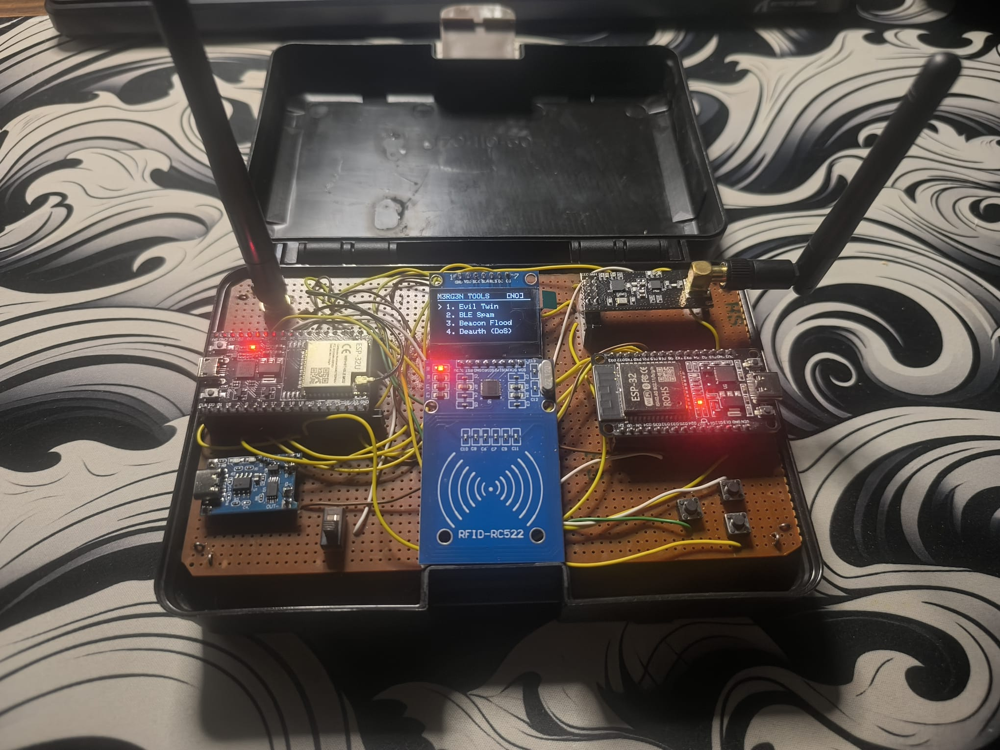
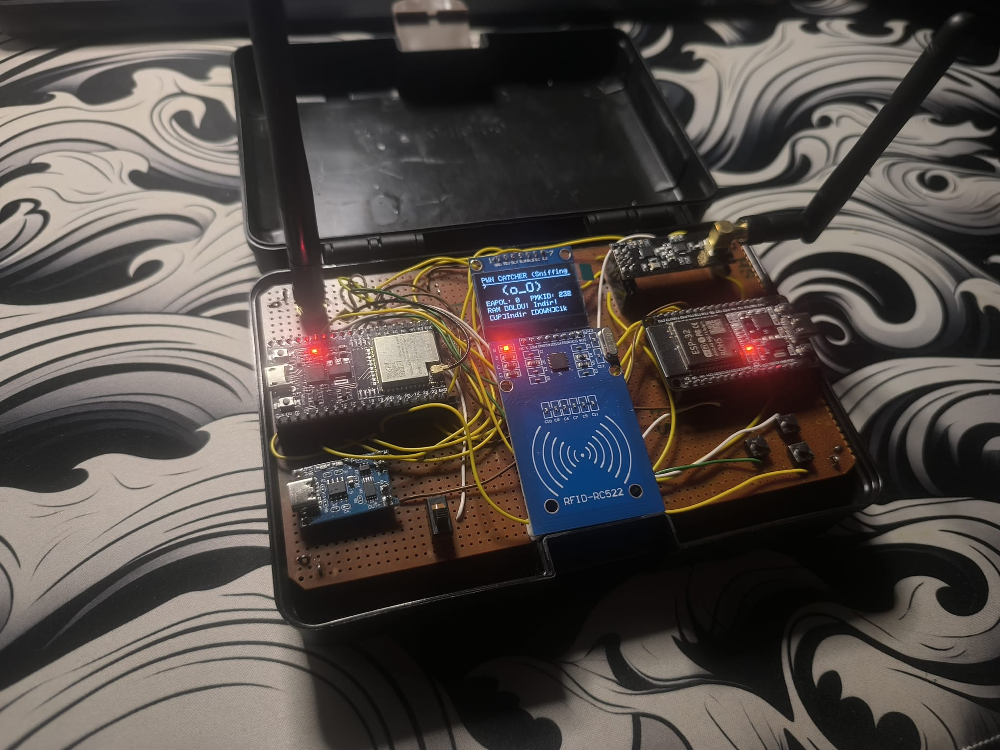
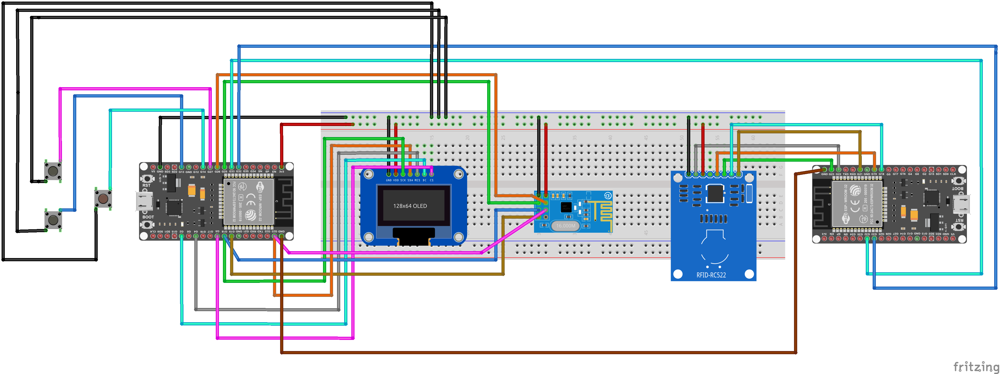

# 📡 Forge-Interceptor: Dual-MCU Physical Pentesting Framework

Forge-Interceptor is an advanced, modular, and portable physical penetration testing framework built on a master-slave Dual-ESP32 architecture. Housed in a stealthy hardcase, it integrates Wi-Fi, Bluetooth (BLE), RFID, and RF (NRF24) attack vectors into a single, air-gapped tactical device.

## 🧠 System Architecture

Unlike standard single-MCU pentest tools, Forge-Interceptor utilizes an asynchronous **Master/Slave** communication protocol via serial interface (TX/RX):

* **Master Node (ESP32-U):** Handles the command-and-control (C2) interface, OLED rendering, user inputs, and RF packet injection (MouseJack/NRF24).
* **Surgeon Node (ESP32-S):** Operates as the heavy-duty attack node. It manages high-resource tasks such as Evil Twin AP hosting, DNS spoofing, web server execution, SD card logging, and SPI-based RFID skimming.

This isolation ensures that UI threads are never blocked by heavy network attacks, preventing brownouts and system crashes.

---

## ⚔️ Tactical Modules & Capabilities

The framework features 15 modular attack and audit vectors, categorized by their target medium:

### 🌐 Wi-Fi Attack Vectors
1.  **Evil Twin:** Deploys a rogue Access Point cloning a target SSID. Features a captive portal to harvest credentials. *air-gapped local web server* (`192.168.4.1/admin`) for discreet payload extraction. (username: admin password:1234)
2.  **Deauth (DoS):** Executes targeted or broadcast deauthentication attacks.
3.  **Beacon Flood:** Overwhelms the 2.4GHz spectrum with thousands of fake SSID beacons.
4.  **Probe Flood:** Stresses local routers by flooding them with continuous probe requests.
5.  **Pwn Catcher (Sniffer):** Captures EAPOL 4-way handshakes and PMKID hashes for offline cracking.

### 📶 RF & Bluetooth Vectors
6.  **BLE Spam:** Floods nearby iOS and Android devices with continuous fake pairing requests.
7.  **MouseJack:** Scans and exploits unencrypted 2.4GHz wireless keyboards and mice using the NRF24L01.
8.  **RF Spectrum Analyzer:** Visualizes raw 2.4GHz RF noise to detect jammers or hidden analog transmitters.
9.  **Drone Sentry:** Passively scans for specific MAC OUI patterns emitted by commercial UAVs.
10. **KeySniffer:** Captures plain-text keystrokes from vulnerable legacy 2.4GHz wireless keyboards.

### 🛡️ Defensive & Physical Vectors
11. **RFID Skimmer:** Interacts with 13.56MHz (MIFARE/NFC) smart cards via the RC522 module. Captures UID data and hosts an *air-gapped local web server* (`192.168.4.1/rfid`) for discreet payload extraction.
12. **WiFi Radar:** Monitors the airwaves for anomalous deauthentication frames.
13. **Traffic Monitor:** A real-time matrix display of channel congestion.
14. **BlueGhost:** Scans for hidden Bluetooth MAC addresses associated with ATM/POS skimming devices.
15. **IR Blaster:** *[Note: WIP]* Infrared capture and replay tool.

---

## ⚙️ Hardware Wiring & Pinout Guide

To replicate the Forge-Interceptor, follow the exact SPI and UART pinout mappings below to avoid hardware collisions.

### 1. Inter-MCU Communication (Critical)
The two ESP32 nodes must share a common ground and cross-communicate via UART.
| ESP32-U (Master) | ESP32-S (Surgeon) | Description |
| :--- | :--- | :--- |
| **GND** | **GND** | **CRITICAL:** Must be connected for serial stability |
| GPIO 32 (TX) | GPIO 33 (RX) | Command Transmission |
| GPIO 33 (RX) | GPIO 32 (TX) | Telemetry & Payload Reception |

### 2. Master Node (ESP32-U) Connections
Handles the UI, Buttons, and NRF24 module. Uses a shared SPI bus for the OLED and NRF24.

| Module | Pin Name | ESP32-U Pin | Notes |
| :--- | :--- | :--- | :--- |
| **OLED 1.3"** | SCK | GPIO 18 | Shared SPI Clock |
| | SDA (MOSI) | GPIO 23 | Shared SPI MOSI |
| | RES (RST) | GPIO 4 | OLED Reset |
| | DC | GPIO 2 | Data/Command |
| | CS | GPIO 5 | Chip Select |
| **NRF24L01** | SCK | GPIO 18 | Shared SPI Clock |
| | MISO | GPIO 19 | Shared SPI MISO |
| | MOSI | GPIO 23 | Shared SPI MOSI |
| | CSN | GPIO 26 | Chip Select |
| | CE | GPIO 25 | Chip Enable |
| | IRQ | Not Connected | Polling is used in software |
| **Control Pad** | UP Button | GPIO 27 | Connect other leg to GND (INPUT_PULLUP) |
| | DOWN Button | GPIO 13 | Connect other leg to GND (INPUT_PULLUP) |
| | ACTION Button | GPIO 14 | Connect other leg to GND (INPUT_PULLUP) |

*⚠️ **Hardware Note:** The NRF24L01 must be powered by **3.3V** and requires a 10uF-100uF capacitor soldered directly across its VCC and GND pins to prevent power drops during transmission.*

### 3. Surgeon Node (ESP32-S) Connections
Handles the physical penetration testing hardware (RFID).

| Module | Pin Name | ESP32-S Pin | Notes |
| :--- | :--- | :--- | :--- |
| **RFID (RC522)**| SCK | GPIO 18 | SPI Clock |
| | MISO | GPIO 19 | SPI MISO |
| | MOSI | GPIO 23 | SPI MOSI |
| | SDA (CS) | GPIO 21 | Chip Select |
| | RST | GPIO 22 | Reset Pin |

*⚠️ **Hardware Note:** The RC522 module operates strictly on **3.3V**. Supplying 5V will instantly destroy the module.*

## ⚙️ Firmware Upload & IDE Settings

For the **Surgeon Node (ESP32-S3)**, ensure your Arduino IDE / PlatformIO settings match the following to utilize the full 16MB Flash and PSRAM:

* **Board:** "ESP32S3 Dev Module"
* **Flash Size:** 16MB (128Mb)
* **Partition Scheme:** 16M Flash (3MB APP/9.9MB FATFS)
* **PSRAM:** "OPI PSRAM"
* **Upload Speed:** 115200

---

## 🚀 Installation & Setup

### Prerequisites
1. Install the [Arduino IDE](https://www.arduino.cc/en/software).
2. Add ESP32 support to your Board Manager.
3. Install the following libraries via the Arduino Library Manager:
   * `Adafruit GFX Library`
   * `Adafruit SH110X` (For the 1.3" OLED)
   * `RF24` by TMRh20
   * `MFRC522` by GithubCommunity
   * `NimBLE-Arduino` (For BLE capabilities)

### Flashing the Code
1. Open the `Master_Node_32U` folder and compile/upload the code to your first ESP32 board.
2. Open the `Surgeon_Node_32S` folder and compile/upload the code to your second ESP32 board.
3. Power the system (3.3v).

---

## ⚠️ Disclaimer

**Forge-Interceptor was developed strictly for educational purposes, academic research, and authorized physical penetration testing (Red Teaming).** The creator(s) and contributor(s) are not responsible for any illegal use, damage, or data loss caused by this tool. Do not use these vectors against networks, devices, or physical infrastructure without explicit, written permission from the owners.